# stylegan-jittor
A jittor version of StyleGAN. This code is modified from https://github.com/rosinality/style-based-gan-pytorch to support [jittor (a deep learning framework based on just-in-time compilation and meta-operators)](https://github.com/Jittor/Jittor).

## Introduction

### StyleGAN

[StyleGAN](https://github.com/NVlabs/stylegan) is a style-based generator architecture for generative adversarial networks (GANs) proposed by NVIDIA in 2018. StyleGAN builds on [Progressive GAN](https://github.com/tkarras/progressive_growing_of_gans) which gradually increases the resolution of generated images from 4x4 to 1024x1024. In addition, StyleGAN makes the following contributions:

- A **mapping network** (implemented as MLP) that maps an input latent code to an intermediate latent code. The authors demonstrate that this design helps remove the distortion of the mapping from the original latent space to the data distribution and also helps to disentangle different features 
- **Adaptive instace normalization (AdaIN)** modules that use affinely transformed intermediate latent code to (adaptively) normalize the feature maps at each convolution block in the synthesis network.
- **Noise injection** at each convolutional block in the synthesis network. 

### Jittor

[Jittor](https://cg.cs.tsinghua.edu.cn/jittor/) is a novel just-in-time (JIT) compiled deep learning framework with meta-operators and unified graph execution. A large part of the success in deep learning should be attributed to the back propagation algorithm, for which the effective execution of computation graphs is crucial. As well-known examples, Tensorflow 1.0 uses static graphs, which must be statically defined before the model can execute, PyTorch uses dynamic graphs and changes can be dynamically made during execution. However, each tensor operator still must be compiled separately. The Jittor way of graph execution is call **unified graph execution**, which, explained in a nutshell, is *globally dynamic but locally static*. Another key concept in Jittor is called **meta-operator**. Meta-operator are the most fundamental operators in Jittor, and all other operations can be represented as composed/fused meta operators. JIT compilation in Jittor seeks to partition the whole computation graph into subgraphs (which are statical) so that the total execution cost is minimized.

## Code Usage 


### Preprocess Dataset

As in https://github.com/rosinality/style-based-gan-pytorch, the `lmdb` preprocessed dataset is used. First organize the picture as follows:

```bash
data-ffhq/
	ffhq/
		00000.png
		00001.png
		...
```

Then

```bash
python prepare_data.py data-ffhq --out data-ffhq-processed
```

### Training

You can run the following command to train the model.


```bash
python train.py data-ffhq-processed --loss r1 --sched --mixing --expname exp_ffhq --max_size 128
```

You can also use `python train.py -h` to check available arguments. During training the generated images will be plotted every 100 iterations and outputted to `exp_ffhq/sample/`. As an example, the picture below shows the output at the 100th (left top), 1000th (left middle), 10000th (right top), 100000th (bottom) iterations.

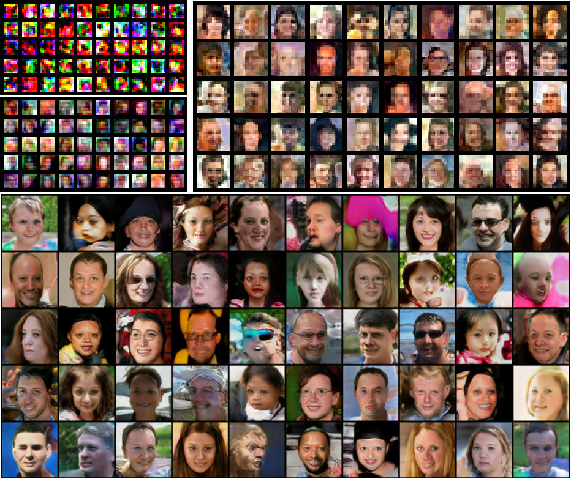

### Generation (Inference time)

After the model is trained, you can generate images in two ways: interpolation and style mixing. Suppose the trained model is placed at `exp_ffhq/checkpoint/300000.model`. For interpolation, run:

```
python --exp_name exp_ffhq exp_ffhq/checkpoint/300000.model
```

This will randomly generate latent vectors and interpolate between them to generate continuously changing images. The results will be saved to `exp_ffhq/interpolation`. Below is an example of the transition from one face to another.

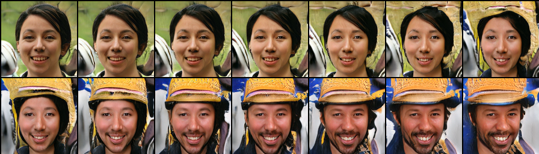

You can also run

```
python style_mixing.py -e exp_ffhq exp_ffhq/checkpoint/300000.model
```

to generate faces with style mixing (outputted to `exp_ffhq/style_mixing/`, shown as below:

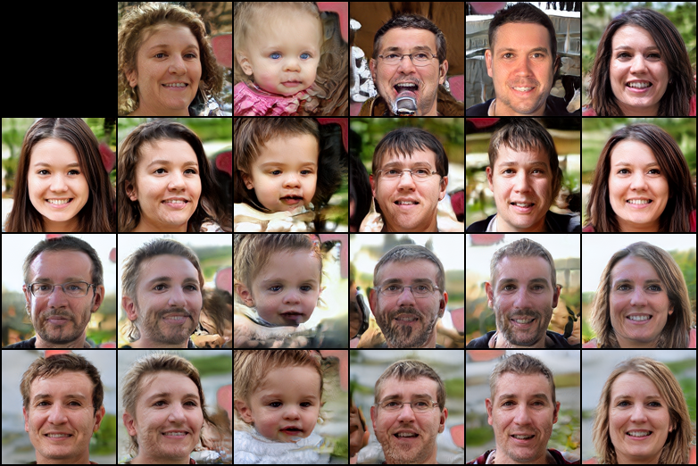

## More Results

The model is trained on the following datasets: FFHQ, CelebA, colored symbols and MNIST. Due to limited computational resources, the training configurations are different from the official setup (detailed below). All experiments are carried out on a single RTX 3090 (24G). Trained models can be found at https://cloud.tsinghua.edu.cn/f/4512da146fc5433e845a/?dl=1 (but the code there is a bit out-dated, ignore it).

### FFHQ

Maximum size is set to 128. Batch sizes at different scheduling steps are set to half of the ones presented in `train.py`. The model is trained for 310000 iterations.

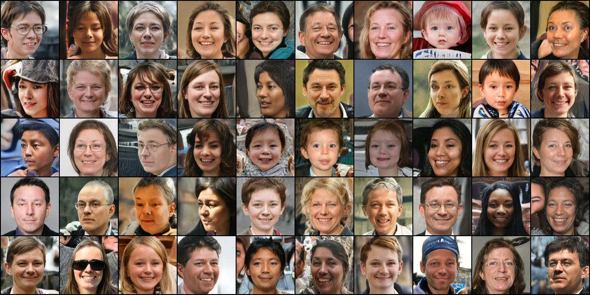

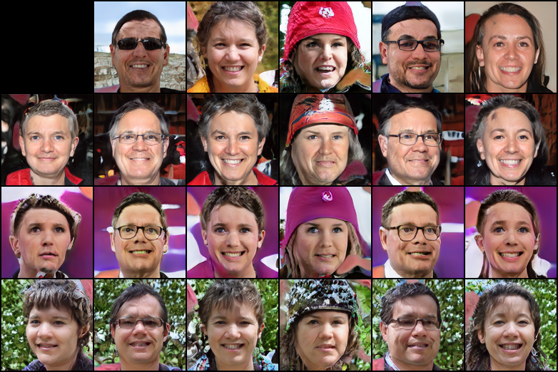

### CelebA

The setup is the same as FFHQ, except that `--loss wgan-gp` is used. The model is trained for 440000 iterations.

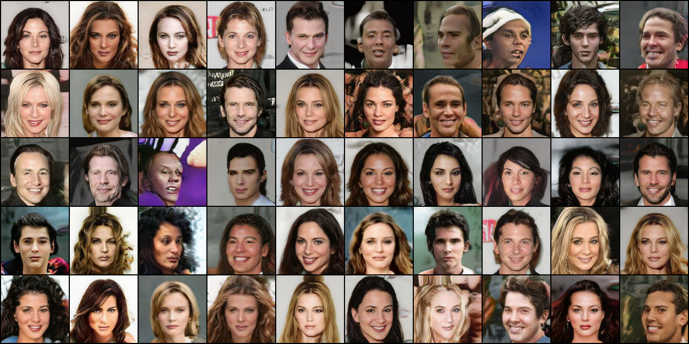

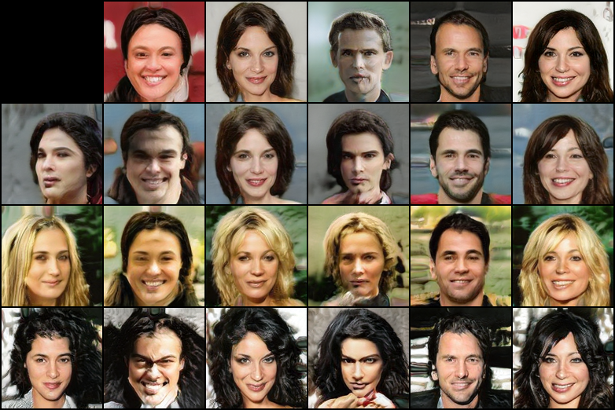

### Color Symbol 7k

This dataset contains 6949 colored Unicode characters in 128x128 . The training options are `--mixing --loss wgan-gp`. Batch size is fixed to 16. Maximum image size is set to 128. The model is trained for 500000 iterations.

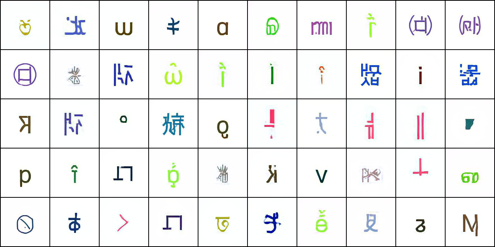

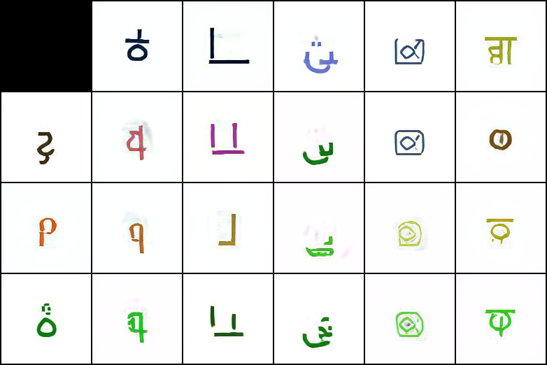

### MNIST

The setup is the the same as the colored symbols, but with maximum image size 32 (since MNIST contains only 28x28 images). This model is trained for 510000 iterations. Note that some numbers are flipped left-to-right because such data augmentation is used (but it probably should not be).

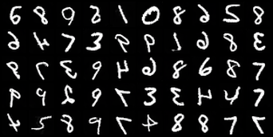

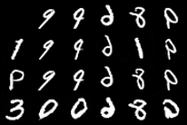


### References

- StyleGAN: [official github repository](https://github.com/NVlabs/stylegan), [pytorch implementation](https://github.com/rosinality/style-based-gan-pytorch), [paper](https://openaccess.thecvf.com/content_CVPR_2019/papers/Karras_A_Style-Based_Generator_Architecture_for_Generative_Adversarial_Networks_CVPR_2019_paper.pdf)
- Jittor: [homepage](https://cg.cs.tsinghua.edu.cn/jittor/), [official github repository](https://github.com/Jittor/Jittor), [other jittor GANs](https://github.com/Jittor/gan-jittor), [paper](https://cg.cs.tsinghua.edu.cn/papers/SCIS-2020-jittor.pdf)
